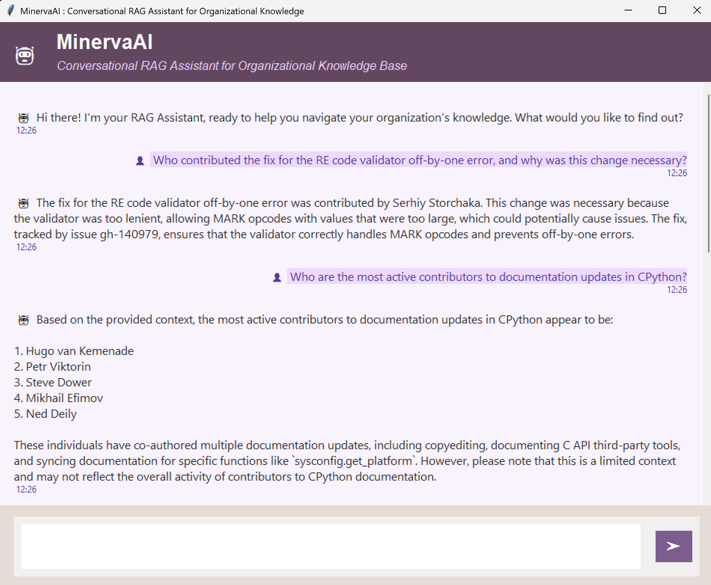
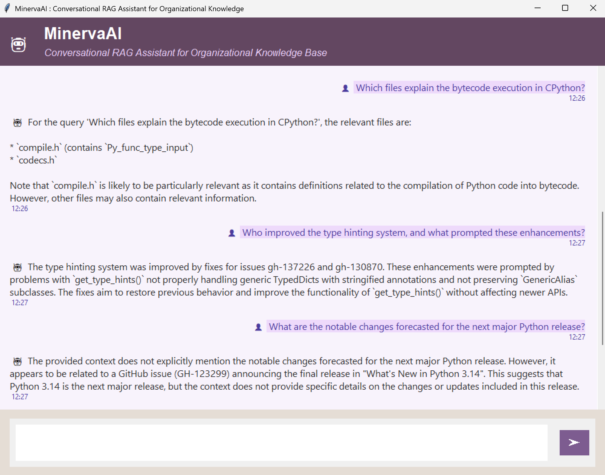
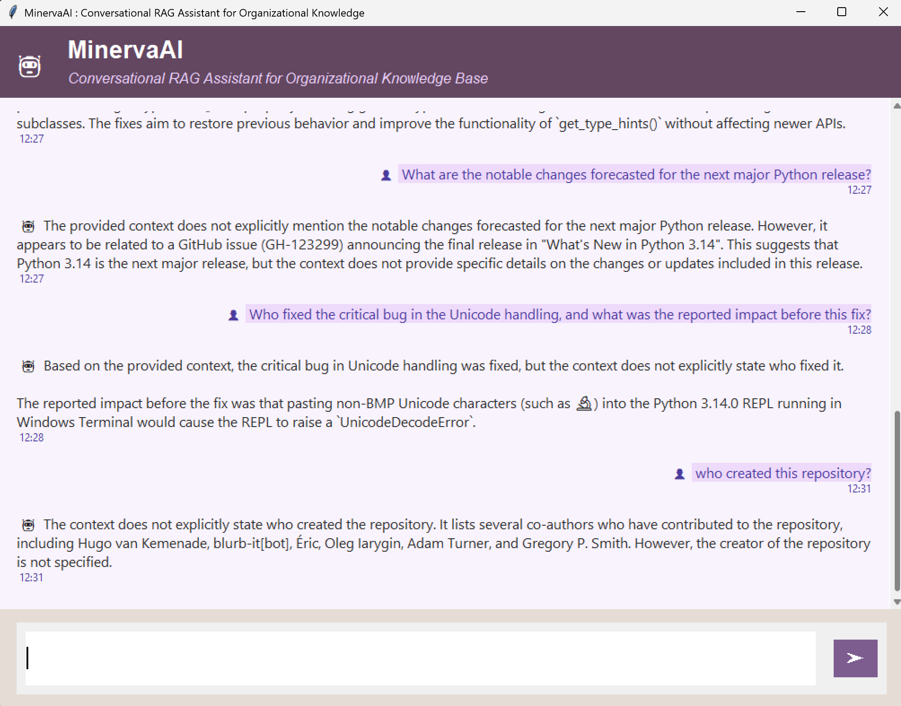
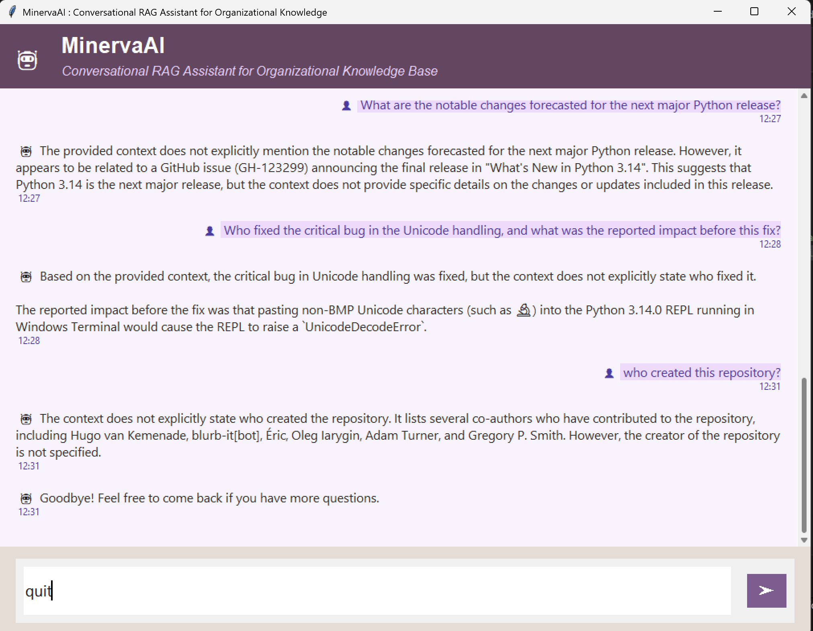

# MinervaAI: Conversational RAG Assistant for Organizational Knowledge Base

## Overview

**MinervaAI** is a simple, local chatbot that helps you search, summarize, and answer questions across your organization's knowledge base. It works with things like your organization's GitHub repository(CPython GitHub repository is used here for demonstration), PDFs, text files, and even meeting notes. It uses advanced RAG (Retrieval-Augmented Generation) and fast vector search to give you detailed answers with full context from your data. MinervaAI works entirely on your own system, so you don’t have to rely on cloud services from outside vendors.

MinervaAI uses smart search and advanced AI models including OpenAI's LLMs to give you clear answers, no matter where the information is stored.


## ✨ Key Features

- **Conversational Chat UI:** Ask questions naturally in a familiar chat window.
- **Unified Knowledge Search:** Search across GitHub code history, issues, and any organizational documents (PDF, TXT, DOCX, CSV, etc.).
- **Organization-First & Private:** Everything runs locally, no sensitive data sent to external third-party servers (**unless configured** for LLM API calls).
- **Extensible Data Support:** Plug-and-play loaders for new file types and data sources.
- **Optimized for Developers:** Easy to adapt/extend for your company’s unique knowledge base.


## 🚀 How MinervaAI is Unique

Some of the most widely used products in organizations for AI-powered knowledge search and chat are

- **Microsoft Copilot (with SharePoint Syntex)**
- **Google Gemini for Workspace**
- **Slack Enterprise Search**


**MinervaAI** gives you private, local control for RAG chat over all your docs (code, PDFs, notes, more) with full flexibility and no vendor restrictions.

| Feature/Aspect             | MinervaAI                        | Microsoft Copilot / Google Gemini / Slack |
|----------------------------|----------------------------------|-------------------------------------------|
| **Runs Locally**           | Yes (fully local or self-hosted) | No (cloud-based)                          |
| **Vendor Lock-in**         | None                             | Yes                                       |
| **Custom Data Types**      | PDFs, TXT, DOCX, CSV, JSON, GitHub, meeting notes, etc. | Mostly native formats (Office, Drive, Slack) |
| **Extensibility**          | High – add new file/data loaders | Limited                                   |
| **Private by Default**     | Yes                              | No, data sent to vendor cloud             |
| **GitHub/SW Support**      | Yes, including code, issues      | Basic integrations only                   |
| **LLM Choice**             | OpenAI, Groq, easy swap          | Vendor AI only (limited customization)    |
| **No Ongoing Cost**        | Yes (open-source, free to use)   | Paid/subscription                         |


## 📁 Directory Structure
```
MinervaAI/
├── data/
│ ├── json/ # Stores exported GitHub data (commits/issues, etc.)
│ ├── pdf/ # Organizational pdf files
│ └── text_files/ # TXT and DOCX files
├── src/
│ ├── init.py
│ ├── data_loader.py
│ ├── download_github_data.py
│ ├── embedding.py
│ ├── search.py
│ └── vector_db.py
├── .env
├── app.py
├── README.md
└── requirements.txt
```

 **When running MinervaAI for the first time, the system will automatically create a `faiss_store/` directory. This contains:**
 - `faiss.index` (the FAISS vector search database)
 - `metadata.pkl` (stores metadata for your indexed files)


## 📦 Purpose of Main Files

- **app.py**: This file starts the main application and uses Tkinter to open the chat window. It connects all the backend parts needed for the assistant to work.
- **src/data_loader.py**: Reads PDF, TXT, DOCX, CSV files, as well as GitHub commit/issue export JSON.
- **src/embedding.py**: Handles splitting documents and embedding them for vector search.
- **src/vector_db.py**: Builds and queries the FAISS vector store for lightning-fast search.
- **src/search.py**: Orchestrates loading, searching, and answering via RAG.
- **src/download_github_data.py**: Script to download and store Github repo commits/issues as JSON.
- **data/json/**: Holds exported GitHub files (see below).
- **faiss_store/**: Auto-created directory and files for persistent search index.


## 📝 About JSON Files and Data Sources

- By default, MinervaAI usees [CPython’s GitHub repo](https://github.com/python/cpython).Replace this link with your organization's GitHub repository when setting up this project.
- The JSON files in `data/json/` store:
    - `git_commits.json`: A list of commit SHAs, messages, authors, dates
    - `git_issues.json`: Issue titles, bodies, authors, numbers, dates
- **Not just GitHub:** Place PDFs, texts, etc. in relevant subfolders for ingestion.


## 🛠️ Technologies Used

- Python 3.10+
- FAISS (`faiss-cpu`)
- Sentence Transformers (`sentence-transformers`)
- LangChain (`langchain`, `langchain-community`, etc.)
- Tkinter
- pypdf (plus optional PDF loaders)

## 🧠 Models Used

- **Embedding Model:** The code uses `all-MiniLM-L6-v2` from [Sentence Transformers](https://www.sbert.net/docs/pretrained_models.html). This model converts text from your documents into numerical vectors for fast semantic search.
- **LLM Models:**
    -  [`openai/gpt-oss-120b`](https://console.groq.com/docs/model/openai/gpt-oss-120b) via Groq :  a powerful open-weight MoE language model from OpenAI, available for high-reasoning and agentic tasks.
    - Optionally, you can use `llama-3-70b-versatile` via Groq API.


## 🧑‍💻 Setup & Installation

1. **Clone the Repo**

```
git clone https://github.com/shimilgithub/MinervaAI.git
cd MinervaAI
```

2. **Create & Activate a Virtual Environment**

```
python -m venv .venv
.venv\Scripts\activate
```

3. **Install Requirements**

`pip install -r requirements.txt`

4. **Setup Environment Variables**

Create `.env` file and insert needed API keys.
```
GROQ_API_KEY = <your_groq_api_key>
GITHUB_API_TOKEN = <your_github_token>
```

5. **Add Your Data**

- **GitHub:** Use `src/download_github_data.py` to fetch and store commits/issues JSON for your project and output to `data/json/`.
- **Other Documents:** Place PDFs in `data/pdf`, text/Word files in `data/text_files`, etc.


## ▶️ How to Run
`python app.py`
- On first run, a `faiss_store/` directory will be created to store the persistent index (`faiss.index`, `metadata.pkl`).
- The UI window appears for interactive chat and search across all indexed data sources.


## 🔄 Workflow

1. **Data loading:** Loads all supported formats (GitHub JSON, PDF, TXT).
2. **Embedding:** Chunks and computes vector embeddings.
3. **Indexing:** Stores results in reusable local FAISS index (`faiss_store/`).
4. **Search & RAG answering:** UI chat triggers semantic search + LLM answer synthesis.
5. **Extensible:** Add new data sources and handlers via `src/data_loader.py`.


## 🖼️ Screenshots

 
 


